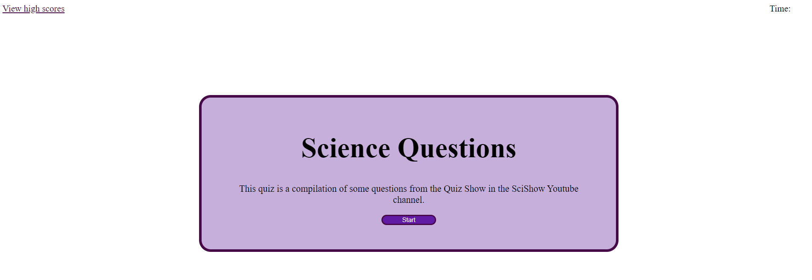

# Timez QuiZ

## Project description 

My task was to create a quiz with a time limit that subtracts time on each incorrect response and adds a point for each correct response. The score would then be saved in local data, and the app is able to store data locally for said highscores. The app is also able to erase the local data to erase all highscores. The biggest skills that I practiced through the creation of this app were how to properly structure and word my questions in the web to find the proper vanilla JavaScript methods to achieve my desired results, and how to read and apply information from documentation.

## Installation/Usage

To see the end result, simply visit [Timed-Quiz](https://kev-rod43.github.io/Timed-Quiz/). 
To see the css file, js file, or the html file, simply [clone](https://docs.github.com/en/repositories/creating-and-managing-repositories/cloning-a-repository "how to clone a github repository") the repository, and open any of them with your preferred code editing software or simple text editor. Alternatively, you can look at the code directly on github.
To utilize the app simply click on the start button, and the questions will start showing. Do your best to answer each question correctly, and dont forget to submit your score at the end!

## Credits

The questions in this quiz all come from the SciShow Youtube channel.